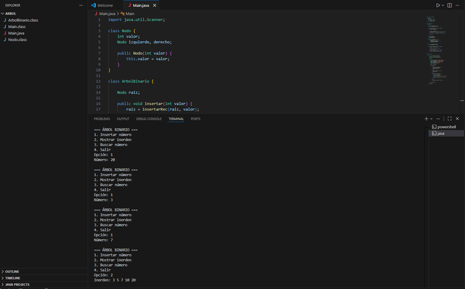
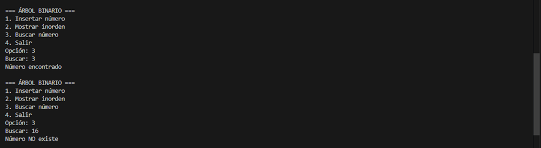

# Árbol Binario en Java

## ¿Qué es un árbol binario?

Un árbol binario es una estructura de datos donde cada nodo tiene como máximo dos hijos:
uno izquierdo y uno derecho.

Se utiliza para organizar información de forma jerárquica.

## ¿Cómo funciona?

Cuando se insertan números:

- Los menores van a la izquierda
- Los mayores van a la derecha

## Recorrido Inorden

El recorrido inorden sigue este orden:

Izquierda → Raíz → Derecha

Ejemplo:

Si insertamos: 10, 5, 20, 3, 7

El resultado es:

3 5 7 10 20

## Funcionalidades del programa

- Insertar números
- Mostrar recorrido inorden
- Buscar números

## Ejecución

Compilar:

```
javac Main.java
```

Ejecutar:

```
java Main
```

## Capturas





## Autor

Johan Andres Ossa